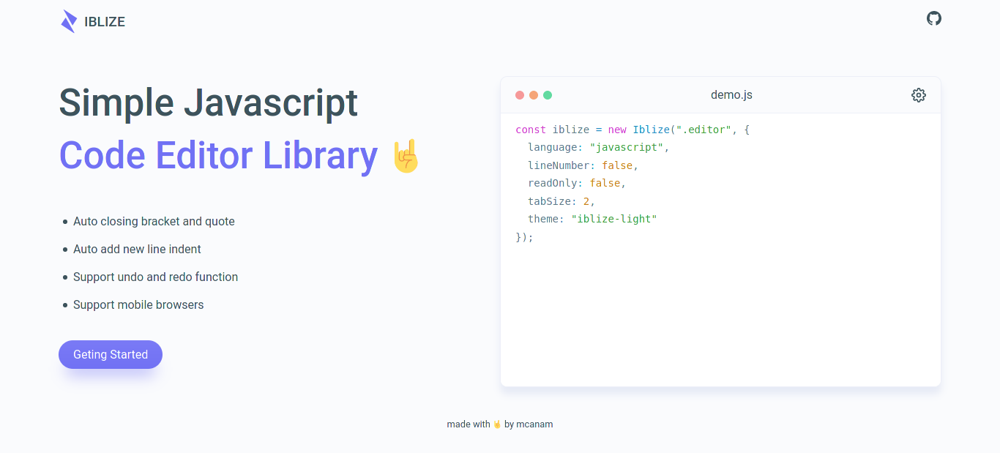

<p align="center">
  
</p>

<br>

<p align="center">
  
</p>

<h3 align="center">IBLIZE - Simple Javascript Code Editor Library</h3>

<p align="center">
  <a href="https://mcanam.github.io/iblize/"><strong>View Demo »</strong></a>
  <br> <br>
  <a href="https://github.com/mcanam/iblize/issues">Report Bug</a>
  <span> - </span>
  <a href="https://github.com/mcanam/iblize/issues">Request Feature</a>
</p>

<br> <br>

## Get Started

#### 1. First include Iblize on your project

you can directly use cdn

```html
<script src="https://unpkg.com/iblize/dist/iblize.js"></script>
```

or install from npm

``` bash
npm install iblize --save
```

or download manually from [here](https://github.com/mcanam/iblize/archive/refs/tags/v2.0.1.zip)

#### 2. Create editor container

because iblize works in web browsers, so iblize needs a div container to hold all elements.

```html
<div id="editor"></div>
```

then set the container width and height. you can also use inline style.

``` css
#editor { width: 100%; height: 400px }
```

#### 3. Create initialization

the first argument can be a string selector or an dom element

```js
// use selector
const iblize = new Iblize("#editor", {
    // options
});

// use dom element
const iblize = new Iblize(document.querySelector("#editor"), {
    // options
});
```

the second argument is options. [see all options](#options)

```js
const iblize = new Iblize("#editor", {
    language: "html",
    // etc
});
```

#### 4. Set editor default value (optional)

you can set editor value programmatically with javascript

``` js
iblize.setValue("console.log('Hello World')");
```

or directly from html (value must be wrapped with comment tag)

``` html
<div id="editor">
<!--
<h1>Hello World</h1>
-->
</div>
```

#### 5. Listening change

listen when the editor value changes

``` js
iblize.onUpdate((value) => {
  // do anything with value
});
```

done 👌. if you find bug or if you have a cool idea please [tell me](https://github.com/mcanam/iblize/issues)  

[explore editor API](#api-reference)

## Options

### `language`
  
- Type: `String`  
  
- Default: `"js"`

the name of language to highlight [list of supported languages](https://prismjs.com/#supported-languages)

> Iblize has some built-in language modules. markup ( html, xml ), css, javascript / js, and clike. By default if you use a language other than the built-in one, Iblize will automatically load the language modules from cdn. But dont worry, if you want to work offline or load the modules locally, you can set `languagesPath` option bellow.

### `languagesPath`
  
- Type: `String`  
  
- Default: `""`

path to **languages** folder. You can find the folder in the **dist** folder.

### `lineNumber`
  
- Type: `Boolean`  
  
- Default: `true`
  
controls the display of line numbers

### `readOnly` 
  
- Type: `Boolean`  
  
- Default: `false`

controls the readonly mode

### `tabSize` 
  
- Type: `Number`  
  
- Default: `2`

the number of spaces

### `theme` 
  
- Type: `String`  
  
- Default: `"iblize-dark"`

the name of theme [themes list](./src/themes/README.md)

> Same with language, by default Iblize will load the themes from cdn.

### `themesPath` 
  
- Type: `String`  
  
- Default: `""`

path to **themes** folder. You can find the folder in the **dist** folder.

## API Reference

### `getValue([from, to])`

- Parameter ( optional ):
    
  - from:
    - Type: `Number`
    - Desc: the start position 
    
  - to:
    - Type: `Number`
    - Desc: the end position 
     
- Return: `String`

get current editor value.

```js
/* example */

const value = iblize.getValue();
const subValue = iblize.getValue(0, 20);
```

### `setValue(value[, recordHistory])`

- Parameter:
    
  - value:  
    - Type: `String`
    - Desc: text to be displayed in the editor 
    
  - recordHistory ( optional ):  
    - Type: `Boolead`
    - Default: `true`
    - Desc: record the value to history 

set editor value

```js
/* example */

const code = "console.log('hello world')";

iblize.setValue(code);
```

### `getOptions()`
  
- Return: `Object`
  
get current editor options.

```js
/* example */

const options = iblize.getOptions();
  ```

### `setOptions(options)`

- Parameter:
  
  - options:
    
    - Type: `Object`
    - Desc: editor options [see all options](#options)
    
update editor options.

```js
/* example */

iblize.setOptions({
    language: "html",
    lineNumber: false
    // etc
});
```

### `onUpdate(callback)`

- Parameter:
  
  - callback:
    
    - Type: `Function`
    - Desc: -

```js
/* example */

iblize.onUpdate((value) => {
    // do something
});
```

### `getSelection()`
  
- Return: `Object`

get editor selected text. it will return object containing start, end, and dir properties.

```js
/* example */

const selection = iblize.getSelection(); // { start, end, dir }
```

### `setSelection(start, end[, dir])`

- Parameter:
    
  - start:  
    - Type: `Number`
    - Desc: index of the first selected character
    
  - end:  
    - Type: `Number`
    - Default: `true`
    - Desc: index of the last selected character

  - dir ( optional ):  
    - Type: `String`
    - Default: `none`
    - Desc: a string indicating the selection direction

set selection

```js
/* example */

iblize.setSelection(0, 10);
```

### `getCursor()`

- Return: `Number`

get current cursor position

```js
/* example */

const cursor = iblize.getCursor();
```

### `setCursor(pos)`
  
- Parameter:
  
  - pos:
    
    - Type: `Number`
    - Desc: -
  
set cursor position

```js
/* example */

iblize.setCursor(20);
```

### `getActiveLine()`

- Return: `Number`

return current active line

```js
/* example */

const activeLine = iblize.getActiveLine();
```

### `getTotalLine()`
  
- Return: `Number`
  
return editor total lines

```js
/* example */

const totalLines = iblize.getTotalLine();
```

### `getLineValue(line)`
  
- Parameter:
  
  - line:
    
    - Type: `Number`
    - Desc: the target of line
    
- Return: `String`

get value from specific line

```js
/* example */

const lineValue = iblize.getLineValue(5);
```

### `insertTab()`

insert tabs programmatically

```js
/* example */

iblize.inserTab();
```

### `insertText(from, text[, options])`
  
- Parameter:
    
  - from:  
    - Type: `Number`
    - Desc: index of the start position to insert text
    
  - text:  
    - Type: `String`
    - Desc: text to be inserted.

  - options ( optional ):  
    - Type: `Object`
    - Properties: 
      
      - recordHistory: 

          - Type: `String`
          - Default: `after`
          - Possible Values: `before` | `after` | `both` | `none`
          - Desc: -

      - moveCursor: 

          - Type: `Number`
          - Desc: cursor position after text is inserted

insert text from specific pos

```js
/* example */

iblize.inserText(5, "what");

iblize.inserText(5, "what", {
  moveCursor: 5,
  recordHistory: "both"
});
```

### `removeText(from: Number, to: Number [, options: Object])`
  
- Parameter:
    
  - from:  
    - Type: `Number`
    - Desc: index of the start position to insert text
    
  - to:  
    - Type: `Number`
    - Desc: index of the end position to remove text

  - options ( optional ):  
    - Type: `Object`
    - Properties: 
      
      - recordHistory: 

          - Type: `String`
          - Default: `after`
          - Possible Values: `before` | `after` | `both` | `none`
          - Desc: -

      - moveCursor: 

          - Type: `Number`
          - Desc: cursor position after text is removed

remove text from specific pos

```js
/* example */

iblize.removeText(5, 6);

iblize.removeText(5, 6, {
  moveCursor: 5,
  recordHistory: "both"
});
```

### `undo()`

undo changes programmatically

```js
/* example */

iblize.undo();
```

### `redo()`

redo changes programmatically

```js
/* example */

iblize.redo();
```

## Dependency

[PrismJs](prismjs.com) - iblize core syntax highlighter

## Browser Compatibility

tested on latest version of major browser

## License

Distributed under the MIT License. See [LICENSE](LICENSE) for more information.
