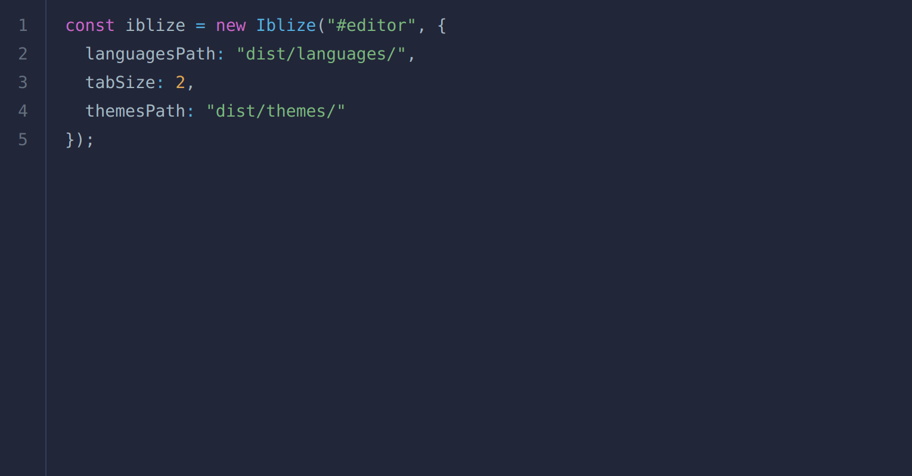
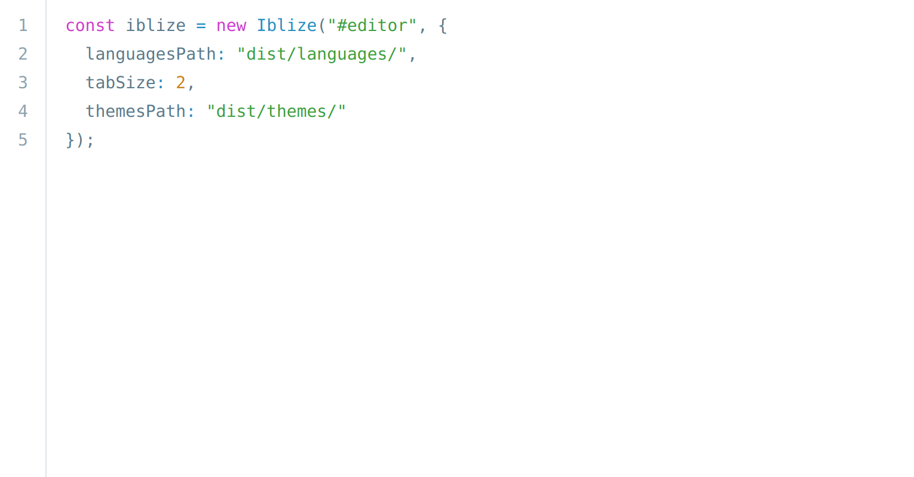
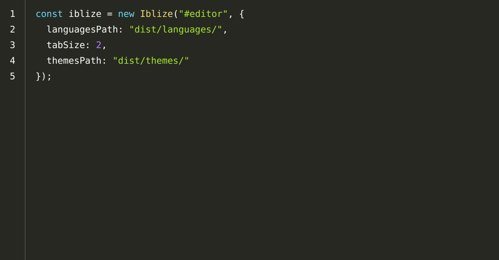
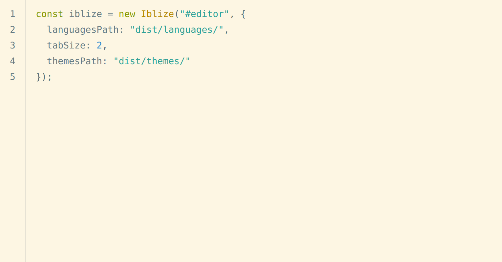
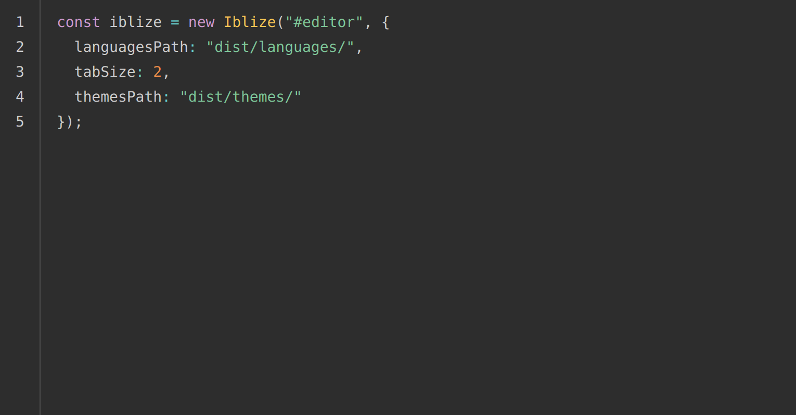
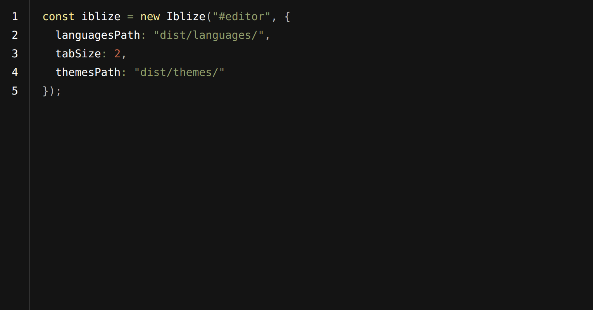

# Iblize Themes

## `iblize-dark`

- author: Iblize
- desciption: Inspired by one dark pro

## `iblize-light`

- author: Iblize
- desciption: Inspired by one dark pro

## `okaidia`

- author: Ocodia
- desciption: Loosely based on Monokai textmate theme by http://www.monokai.nl/

## `solarized-light`

- author: Hector Matos https://krakendev.io
- desciption: Solarized color schemes originally by Ethan Schoonover http://ethanschoonover.com/solarized

## `tomorrow-night`

- author: Rose Pritchard
- desciption: Based on https://github.com/chriskempson/tomorrow-theme

## `twilight`

- author: Remy Bach
- desciption: Based (more or less) on the Twilight theme originally of Textmate fame.

